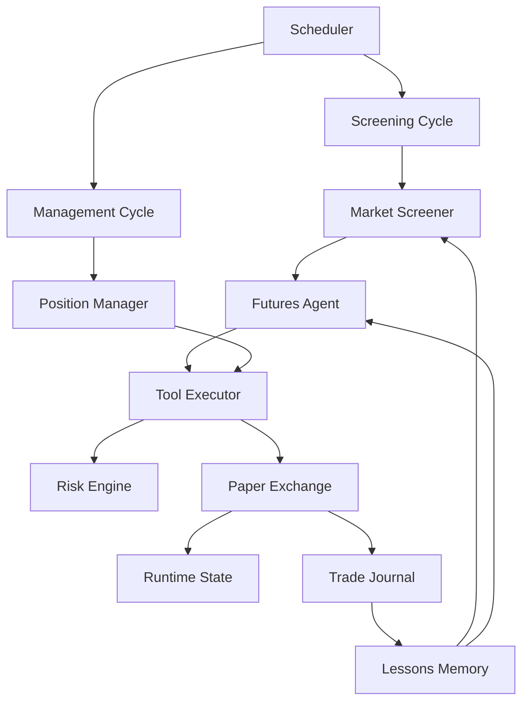

# Paper Futures Bot

Scaffold bot futures paper-trading berbasis Node.js dengan arsitektur akurat:

- deterministic screening lebih dulu
- decision engine di lapisan agent
- hard guardrails di tool executor dan risk engine
- state, lessons, dan journal yang persisten

Bot ini belum menembak exchange sungguhan. Semua order masuk ke `paper-exchange`, jadi aman untuk eksperimen strategi dan orkestrasi.

Per 20 April 2026, scaffold ini sudah bisa memakai market data futures Bybit V5 untuk screening dan quote, sambil tetap menjaga execution di paper mode lokal.

## Arsitektur



## Modul Inti

- `src/core/screening-cycle.js`: meniru `runScreeningCycle()` di Meridian. Mengambil market universe, memfilter kandidat, lalu memilih trade terbaik atau `NO_TRADE`.
- `src/core/management-cycle.js`: meniru `runManagementCycle()`. Menilai posisi terbuka terhadap stop loss, take profit, trailing stop, dan batas waktu.
- `src/core/agent.js`: lapisan decision engine. Saat ini deterministic, tapi bentuknya sudah siap diganti ke LLM nanti.
- `src/core/tool-executor.js`: gerbang keras untuk aksi seperti `open_paper_position` dan `close_paper_position`.
- `src/risk/risk-engine.js`: sizing posisi, margin check, daily loss guard, max positions, dan larangan double exposure per simbol.
- `src/exchange/paper-exchange.js`: simulator akun futures sederhana dengan isolated-margin style bookkeeping.
- `src/memory/lessons.js`: menyimpan bias belajar per simbol dan per side dari histori trade.
- `src/journal/trade-journal.js`: audit log trade dan event operasional.
- `src/state/store.js`: penyimpanan JSON persisten untuk account, positions, metrics, decisions, lessons, dan journal.

## Alur Runtime

1. `MarketDataFeed` menyiapkan snapshot market sintetis untuk simbol futures.
2. `MarketScreener` menyaring market berdasarkan volume, open interest, spread, funding, dan signal strength.
3. `FuturesAgent` memilih kandidat terbaik berdasarkan strategy library dan lessons memory.
4. `ToolExecutor` memanggil `RiskEngine` untuk sizing, lalu mengirim order ke `PaperExchange`.
5. `ManagementCycle` mengevaluasi posisi terbuka dan menutup posisi jika guardrail exit terpenuhi.
6. Semua aksi ditulis ke `data/*.json` agar mudah diaudit dan dipakai untuk iterasi strategi.

Kalau `MARKET_DATA_PROVIDER=bybit`, langkah pertama berubah menjadi pengambilan data live dari endpoint Bybit `Get Tickers` dan `Get Kline`, lalu bot menurunkan `trendScore`, `momentumScore`, `liquidityScore`, dan `structureScore` dari data itu.

## Mulai Dari Nol

### 1. Prasyarat

- Git sudah terpasang
- Node.js 20 atau lebih baru
- Koneksi internet untuk mengambil market data Bybit

Bot ini belum butuh API key Bybit karena execution masih full paper trading lokal.

### 2. Clone Repository

```bash
git clone https://github.com/rexxlite/autotrade.git
cd autotrade
```

### 3. Install Dependency

```bash
npm install
```

### 4. Buat File Environment

PowerShell:

```powershell
Copy-Item .env.example .env
```

Bash:

```bash
cp .env.example .env
```

Kalau baru mau testing, biasanya tidak perlu ubah apa pun di `.env`. Default repo ini sudah:

- memakai market data live Bybit
- menjalankan execution di paper mode lokal
- memakai simbol futures yang umum dan likuid

### 5. Cek Bot Sudah Siap

```bash
npm run status
```

Kalau sukses, kamu akan melihat:

- account paper dengan balance awal
- `Market Data Provider` aktif
- belum ada posisi terbuka

### 6. Lihat Snapshot Market Bybit

```bash
npm run market
```

Command ini berguna untuk memastikan data futures Bybit berhasil ditarik sebelum kamu mulai screening.

### 7. Jalankan Satu Screening Cycle

```bash
npm run screen
```

Bot akan:

- mengambil market snapshot Bybit
- menyaring kandidat
- memilih trade terbaik jika ada setup yang lolos
- membuka posisi paper, bukan posisi real

### 8. Kelola Posisi yang Sudah Terbuka

```bash
npm run manage
```

Command ini mengecek stop loss, take profit, trailing stop, dan batas waktu holding.

### 9. Jalankan Scheduler Otomatis

```bash
npm start
```

Mode ini akan menjalankan screening dan management cycle berulang sesuai cron di `.env`.

### 10. Tutup Semua Posisi Paper Secara Manual

```bash
npm run flatten
```

Ini berguna sebagai kill switch saat testing.

## Alur Testing Yang Disarankan

Kalau baru pertama kali clone, urutan paling aman biasanya:

1. `npm run status`
2. `npm run market`
3. `npm run screen`
4. `npm run manage`
5. `npm start`

Kalau hasil `screen` belum membuka posisi, itu normal. Artinya market saat itu tidak lolos threshold strategi yang aktif.

## Perintah

- `npm run status`: lihat account, posisi terbuka, pelajaran terakhir, dan trade terbaru.
- `npm run market`: lihat snapshot market yang sedang dipakai screener.
- `npm run screen`: jalankan satu screening cycle.
- `npm run manage`: jalankan satu management cycle.
- `npm run flatten`: tutup semua posisi paper terbuka di mark price terbaru.
- `npm start`: jalankan scheduler berulang dengan cron dari `.env`.

## Konfigurasi Bybit

- `MARKET_DATA_PROVIDER=bybit`: gunakan market data Bybit live.
- `BYBIT_TESTNET=false`: pakai public market data mainnet Bybit. Ubah ke `true` kalau memang ingin memakai host testnet.
- `BYBIT_SYMBOLS=...`: daftar simbol linear futures yang mau di-screen. Kosongkan kalau mau auto-pilih simbol USDT linear paling likuid.
- `BYBIT_KLINE_INTERVAL=60`: interval candle untuk feature engineering.
- `BYBIT_KLINE_LIMIT=24`: jumlah candle untuk menghitung trend, momentum, dan struktur.

Mode ini tetap aman karena order tidak dikirim ke Bybit. Yang berubah hanya sumber market data.

## Troubleshooting Singkat

- Kalau `npm install` gagal: cek versi Node.js, pastikan minimal versi 20.
- Kalau `npm run market` gagal: cek koneksi internet atau coba lagi beberapa detik kemudian.
- Kalau `npm run screen` tidak membuka posisi: itu biasanya karena tidak ada kandidat yang lolos filter saat itu.
- Kalau mau kembali ke feed simulasi: ubah `MARKET_DATA_PROVIDER=synthetic` di `.env`.

## Struktur Folder

```text
paper-futures-bot/
  data/
  src/
    core/
    exchange/
    journal/
    memory/
    portfolio/
    risk/
    state/
    strategy/
```

## Titik Lanjut

- Tambahkan private Bybit adapter untuk testnet order placement setelah paper flow-nya stabil.
- Ganti `FuturesAgent` deterministic dengan LLM planner yang memakai prompt mirip Meridian.
- Tambahkan adapter OKX atau Binance Futures di lapisan `exchange/`.
- Tambahkan Telegram/Discord notifier dan remote config sync jika mau meniru surface ops Meridian lebih dekat.
