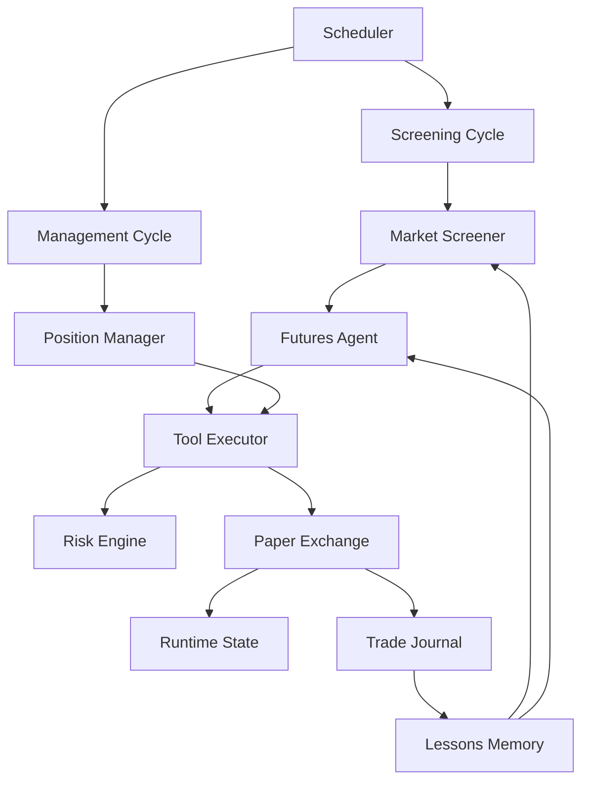

# Paper Futures Bot

Scaffold bot futures paper-trading berbasis Node.js dengan arsitektur yang sengaja meniru pola inti Meridian:

- deterministic screening lebih dulu
- decision engine di lapisan agent
- hard guardrails di tool executor dan risk engine
- state, lessons, dan journal yang persisten

Bot ini belum menembak exchange sungguhan. Semua order masuk ke `paper-exchange`, jadi aman untuk eksperimen strategi dan orkestrasi.

Per 20 April 2026, scaffold ini sudah bisa memakai market data futures Bybit V5 untuk screening dan quote, sambil tetap menjaga execution di paper mode lokal.

## Arsitektur



## Modul Inti

- `src/core/screening-cycle.js`: meniru `runScreeningCycle()` di Meridian. Mengambil market universe, memfilter kandidat, lalu memilih trade terbaik atau `NO_TRADE`.
- `src/core/management-cycle.js`: meniru `runManagementCycle()`. Menilai posisi terbuka terhadap stop loss, take profit, trailing stop, dan batas waktu.
- `src/core/agent.js`: lapisan decision engine. Saat ini deterministic, tapi bentuknya sudah siap diganti ke LLM nanti.
- `src/core/tool-executor.js`: gerbang keras untuk aksi seperti `open_paper_position` dan `close_paper_position`.
- `src/risk/risk-engine.js`: sizing posisi, margin check, daily loss guard, max positions, dan larangan double exposure per simbol.
- `src/exchange/paper-exchange.js`: simulator akun futures sederhana dengan isolated-margin style bookkeeping.
- `src/memory/lessons.js`: menyimpan bias belajar per simbol dan per side dari histori trade.
- `src/journal/trade-journal.js`: audit log trade dan event operasional.
- `src/state/store.js`: penyimpanan JSON persisten untuk account, positions, metrics, decisions, lessons, dan journal.

## Alur Runtime

1. `MarketDataFeed` menyiapkan snapshot market sintetis untuk simbol futures.
2. `MarketScreener` menyaring market berdasarkan volume, open interest, spread, funding, dan signal strength.
3. `FuturesAgent` memilih kandidat terbaik berdasarkan strategy library dan lessons memory.
4. `ToolExecutor` memanggil `RiskEngine` untuk sizing, lalu mengirim order ke `PaperExchange`.
5. `ManagementCycle` mengevaluasi posisi terbuka dan menutup posisi jika guardrail exit terpenuhi.
6. Semua aksi ditulis ke `data/*.json` agar mudah diaudit dan dipakai untuk iterasi strategi.

Kalau `MARKET_DATA_PROVIDER=bybit`, langkah pertama berubah menjadi pengambilan data live dari endpoint Bybit `Get Tickers` dan `Get Kline`, lalu bot menurunkan `trendScore`, `momentumScore`, `liquidityScore`, dan `structureScore` dari data itu.

## Quick Start

```bash
cd paper-futures-bot
copy .env.example .env
npm install
npm run status
npm run market
npm run screen
npm run manage
npm start
```

## Perintah

- `npm run status`: lihat account, posisi terbuka, pelajaran terakhir, dan trade terbaru.
- `npm run market`: lihat snapshot market yang sedang dipakai screener.
- `npm run screen`: jalankan satu screening cycle.
- `npm run manage`: jalankan satu management cycle.
- `npm run flatten`: tutup semua posisi paper terbuka di mark price terbaru.
- `npm start`: jalankan scheduler berulang dengan cron dari `.env`.

## Konfigurasi Bybit

- `MARKET_DATA_PROVIDER=bybit`: gunakan market data Bybit live.
- `BYBIT_TESTNET=false`: pakai public market data mainnet Bybit. Ubah ke `true` kalau memang ingin memakai host testnet.
- `BYBIT_SYMBOLS=...`: daftar simbol linear futures yang mau di-screen. Kosongkan kalau mau auto-pilih simbol USDT linear paling likuid.
- `BYBIT_KLINE_INTERVAL=60`: interval candle untuk feature engineering.
- `BYBIT_KLINE_LIMIT=24`: jumlah candle untuk menghitung trend, momentum, dan struktur.

Mode ini tetap aman karena order tidak dikirim ke Bybit. Yang berubah hanya sumber market data.

## Struktur Folder

```text
paper-futures-bot/
  data/
  src/
    core/
    exchange/
    journal/
    memory/
    portfolio/
    risk/
    state/
    strategy/
```

## Titik Lanjut

- Tambahkan private Bybit adapter untuk testnet order placement setelah paper flow-nya stabil.
- Ganti `FuturesAgent` deterministic dengan LLM planner yang memakai prompt mirip Meridian.
- Tambahkan adapter OKX atau Binance Futures di lapisan `exchange/`.
- Tambahkan Telegram/Discord notifier dan remote config sync jika mau meniru surface ops Meridian lebih dekat.
